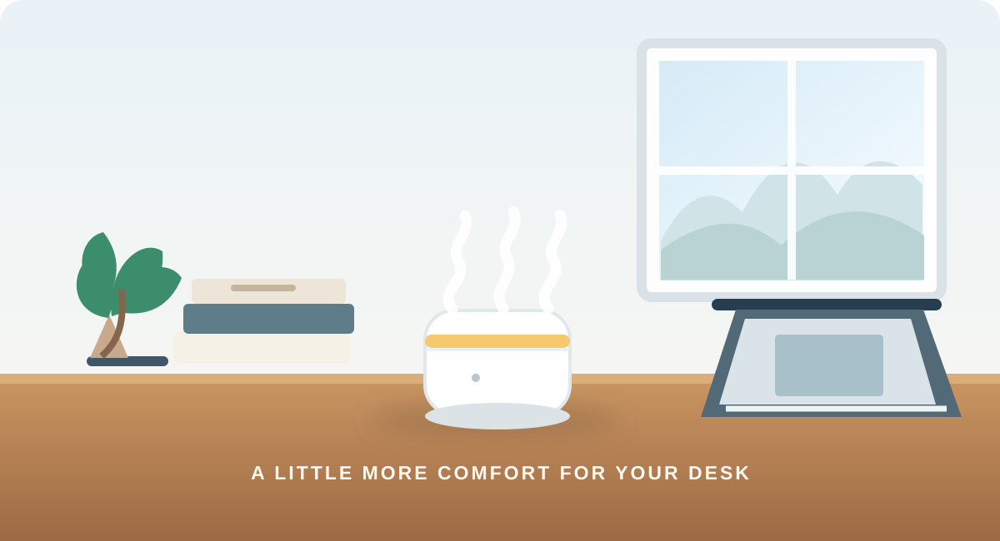

# HubSpot Email Marketing Simulation

### DeskBloom Living | AIC Marketing Coursework | September 2026

A portfolio project demonstrating HubSpot contact management, audience selection, promotional email design, and mobile quality checks.

## Project at a Glance

| | |
|---|---|
| **Platform** | HubSpot CRM and Marketing Email |
| **Project context** | AIC marketing coursework simulation |
| **Fictional brand** | DeskBloom Living |
| **Product concept** | Portable USB mini humidifier |
| **Audience** | Office workers |
| **Offer shown** | Indicative simulated price of A$19.95 |

## STAR Case Study

### Situation

For an AIC marketing coursework project, I needed to turn a product concept into a clear promotional email and demonstrate how contacts could be organised and selected in HubSpot. The fictional brand, DeskBloom Living, offered a portable USB mini humidifier for office workspaces.

### Task

I set out to build and test a branded email campaign simulation, prepare a small test audience, and check that the message was easy to understand on mobile. The intended recipient group was three contacts.

### Action

- Prepared three contact records with separate first name, last name, and email fields.
- Created a dedicated HubSpot segment named **DeskBloom - Email Test Group** and confirmed the send setup showed **3 of 3 estimated recipients**.
- Wrote benefit-led promotional copy with an indicative A$19.95 price, a clear call to action, and enquiry contact details.
- Customised the HubSpot email template with DeskBloom Living branding, a logo, product imagery, a subject line, and preview text.
- Sent a test email and reviewed its mobile display, checking image rendering, text readability, price visibility, and button presentation.

### Result

- Completed a branded HubSpot marketing email simulation and test send.
- Verified the intended audience selection at **3 of 3 estimated recipients** before sending.
- Reviewed the received email on mobile and confirmed the main content and call to action were visible.
- No sales, purchases, opens, or click-through results are claimed; campaign performance was not measured as a real consumer campaign.

## Email Copy

**Subject line:** A Little More Comfort for Your Desk — A$19.95  
**Preview text:** Meet the compact USB mini humidifier designed for your workspace.  
**Call to action:** Explore the Mini Humidifier

## Skills Demonstrated

HubSpot CRM · Contact management · Audience segmentation · Email marketing · Promotional copywriting · Customer-focused communication · Data accuracy · Mobile email testing · Attention to detail

## Relevance to Education Enquiry Support

The project demonstrates transferable skills for customer and student enquiry support: maintaining accurate contact records, selecting the intended audience, communicating an offer clearly, and providing a straightforward response path. It is a consumer-product coursework simulation and does not represent admissions or student recruitment experience.

## Scope and Privacy

DeskBloom Living and the product offer are fictional. The A$19.95 price is illustrative and does not represent a live offer. Contact details and recipient screenshots are intentionally excluded from this public portfolio repository.
